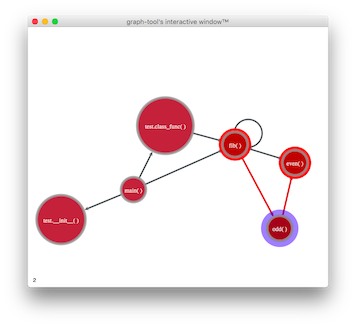

# Structure

An experiment in graphing the control flow of a Python program.  Currently does not support multithreaded applications.  Graphing done with [Graph-Tool](https://graph-tool.skewed.de).

## Usage

First, include the following at the start of your code that you would like to profile.

    import structure

    s = structure.Structure()
    s.setMaxDepth(depth = 3)       # Option: Don't log call stack depth > n
    s.setLocal(True)               # Option: Only log files in your script's directory
    s.setLogFile("test.log")       # Set the location of the log file
    s.beginTrace()

Run your code.  The log file "test.log" will be produced.  When your code terminates, we're ready to graph the data.

    import stackgraph

    G = stackgraph.StackGraph()
    G.load("test.log")              # All the heavy lifting happens here
    G.display()

## Graph structure

Results will be stored in a directed graph, where each node represents a function, and an arrow on an edge shows the direction of function calls.

An edge will contain a list of length-2 lists, each of which representing one function call that occurred.  To each of these we record:
* Timestamp of each call
* Depth of each call

A node will correspond to a function.  It contains:
* Filename where the function is defined
* Name of the containing class if it is a class method
* The function name

In the future, it may contain:
* Elapsed runtime
* A breakdown including time spent waiting for child functions to return

## Goal features

* An interactive web-based graph explorer
* On the fly changing of depth that we display
* Playback of program's run by using timestamp data
